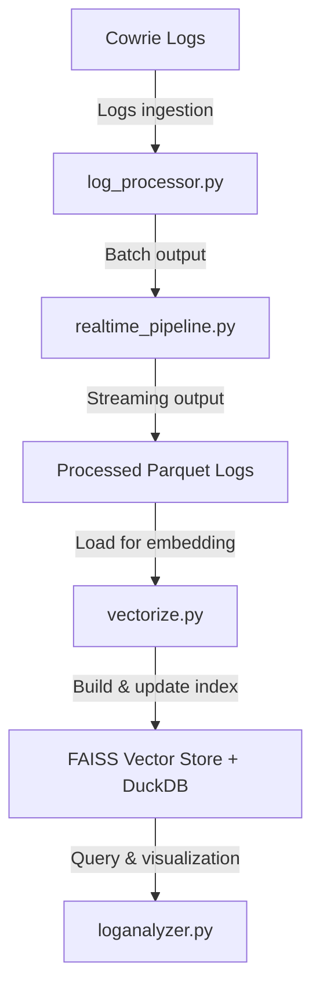

# Conversational AI-Enhanced Analysis of Retrieval Augmented Generation for Honeypot Data


Conversational AI-Enhanced Analysis of Retrieval Augmented Generation for Honeypot Data is an advanced cybersecurity log analysis and threat intelligence platform designed to ingest, enrich, analyze, and interactively query honeypot logs (such as Cowrie) using modern AI-powered techniques. It incorporates scalable real-time and batch pipelines, vector-based semantic search, MITRE ATT&CK mapping, anomaly detection, geospatial visualization, and an AI-driven chatbot interface for deep cyber threat investigation.

---

## Features

- **Incremental and batch parsing** of JSON Cowrie honeypot logs with session reconstruction and metadata enrichment.
- **MITRE ATT&CK TTP mapping** and comprehensive anomaly detection from attacker commands.
- **IP geolocation enrichment** with caching and support for multiple geolocation services.
- **FAISS vector store creation** and IVF index upgrade for scalable similarity search on attack data.
- **DuckDB-based structured analytics** supporting SQL querying and aggregation over enriched logs.
- **Interactive RAG chatbot** powered by LangChain and Groq LLM for natural language threat queries.
- **Visual analytics** including geospatial attack maps (Pydeck), time series, and plots with Plotly.
- **Stateful incremental processing** with JSON state tracking to enable robust resumption and deduplication.

---

## Repository Structure

| File                   | Description                                                |
|------------------------|------------------------------------------------------------|
| `log_processor.py`      | Batch and incremental JSON honeypot log parser with enrichment and export capability. |
| `realtime_pipeline.py` | Real-time pipeline to stream, parse, enrich, vectorize, and save logs incrementally. |
| `vectorize.py`         | Vectorizes processed logs into FAISS and manages vector embeddings and DuckDB metadata export. |
| `faiss-ivf_upgrade.py` | Utility to upgrade or merge FAISS flat vector stores to IVF indexes for scalable search. |
| `loganalyzer.py`       | Streamlit web app providing an AI chatbot interface, SQL analytics explorer, and attack visualizer. |
| `.env`                 | Environment configuration file with API keys and pipeline settings. |
| `requirements.txt`     | Python package dependencies pinned for consistent environment setup. |

---

## Installation

1. Clone the repository:
```py
git clone https://github.com/yourusername/pmics.git](https://github.com/FahimAhsan01/LogAnalyzer.git)
cd LogAnalyzer
```

2. Create and activate a Python virtual environment (recommended):
```py
python -m venv venv
source venv/bin/activate # Linux/macOS
venv\Scripts\activate # Windows
```

3. Install dependencies:
```py
pip install -r requirements.txt
```

4. Create a `.env` file with your API keys and configuration (copy from `.env_sample`):
```py
HF_TOKEN=your_huggingface_token
GROQ_API_KEY=your_groq_api_key
IPINFO_TOKEN=your_ipinfo_token
COWRIE_OUTPUT_DIR=processed_data
COWRIE_OUTPUT_FORMAT=parquet
COWRIE_MAX_WORKERS=4
DATA_DIR=processed_data
VECTOR_DB_PATH=vectorstore/db_faiss
DUCKDB_PATH=vectorstore/vector_metadata.duckdb
EMBEDDING_MODEL=sentence-transformers/all-MiniLM-L6-v2
CHUNK_SIZE=1000
CHUNK_OVERLAP=50
EMBEDDING_BATCH_SIZE=512
PROCESSED_LOG=processed_files_log.json
DB_FAISS_PATH=vectorstore/db_faiss
DUCKDB_TABLE=vector_chunks
CACHE_TTL=3600
```

---

## Usage

### Log Processor (Batch)

Parse and enrich honeypot logs locally or remotely with incremental progress tracking:
```py
python logprocessor.py /path/to/logfile.json --output_dir processed_data --output_format parquet
```

Supports filters by date, session IDs, event IDs, and multi-file parallel parsing.

---

### Realtime Pipeline

Continuously stream and process honeypot logs with automated vectorization and DuckDB ingestion:

```py
python realtime_pipeline.py
```

Runs in streaming mode, reads only new entries, performs enrichment, updates FAISS, and exports Parquet and DuckDB metadata.

---

### Vectorize Logs to FAISS

Batch vector embedding of processed parquet logs to build or retrain FAISS IVF indexes:

```py
python vectorize.py --data_dir processed_data --vector_db vectorstore/db_faiss --duckdb_path vectorstore/vector_metadata.duckdb --retrain_index
```

Supports filtering, batch size tuning, and index cluster counts.

---

### FAISS IVF Upgrade / Merge Tool

Upgrade existing FAISS vectorstores from flat to IVF indexes for scalable similarity search:

```py
python faiss-ivf_upgrade.py
```

Interactive prompts allow specifying source and target stores, model, and cluster counts; supports merging multiple vectorstores.

---

### Log Analyzer (Streamlit Web App)

Launch an AI-powered interactive interface to query, analyze, and visualize your enriched honeypot data seamlessly:

```py
streamlit run loganalyzer.py
```

Features:
- Conversational cybersecurity assistant chatbot (RAG with latest context).
- SQL querying UI over DuckDB metadata.
- Geospatial attack map with insightful visualizations.
- Advanced cache and app resource monitoring.

---

## Architecture Overview

**Pipeline Stages:**

- **Cowrie Logs (JSON):** Raw honeypot data source
- **logprocessor.py:** Batch parse & enrich logs
- **realtime_pipeline.py:** Streaming parse & vectorize
- **Processed Parquet Logs:** Enriched logs
- **vectorize.py:** Embedding & indexing for search/analytics
- **FAISS Vector Store + DuckDB:** Fast semantic retrieval and SQL analytics
- **loganalyzer.py:** Web UI for chat & data visualization

---

## Contributing

Contributions to this project are welcome! Please:

- Fork the repo and create branches for features/fixes.
- Follow PEP8 Python style.
- Write clear commit messages.
- Test your changes thoroughly.
- Open issues or pull requests with detailed descriptions.

---

## License

This project is licensed under the MIT License.

---

## Acknowledgments

- Based on open-source tools: [Cowrie Honeypot](https://github.com/cowrie/cowrie), [LangChain](https://github.com/hwchase17/langchain), [FAISS](https://github.com/facebookresearch/faiss), [DuckDB](https://duckdb.org/), and more.
- Inspired by modern cybersecurity AI research and honeypot intelligence systems.

---

## Contact

For questions or support, please file an issue or contact me at:
fahimahsan01@gmail.com

---

